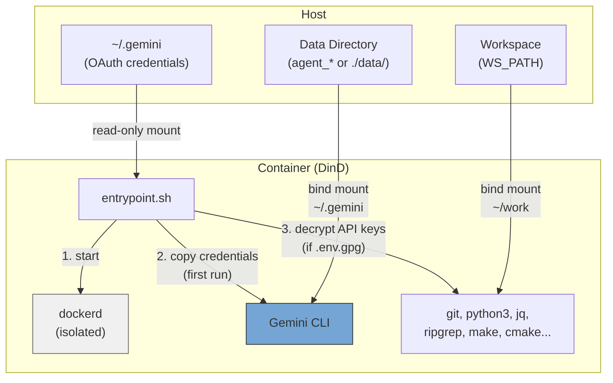
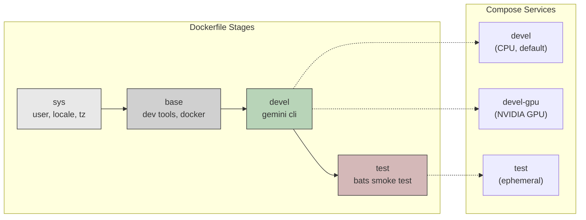
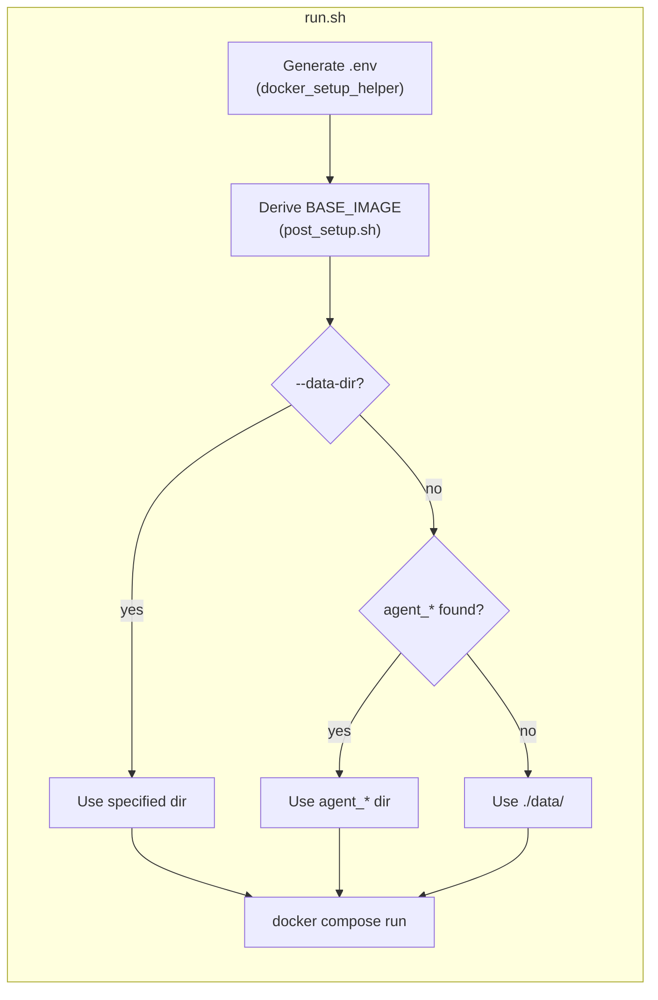

# Gemini CLI Docker Environment

Docker-in-Docker (DinD) development container for Gemini CLI, Google's AI command-line tool. Available in CPU and NVIDIA GPU variants. Runs as non-root user with host UID/GID matching.

## Table of Contents

- [TL;DR](#tldr)
- [Overview](#overview)
- [Prerequisites](#prerequisites)
- [Quick Start](#quick-start)
- [Conversation Persistence](#conversation-persistence)
- [Running Multiple Instances](#running-multiple-instances)
- [Authentication](#authentication)
  - [OAuth (Interactive Login)](#oauth-interactive-login)
  - [API Key (Encrypted)](#api-key-encrypted)
- [Configuration](#configuration)
- [Smoke Tests](#smoke-tests)
- [Architecture](#architecture)
  - [Dockerfile Stages](#dockerfile-stages)
  - [Compose Services](#compose-services)
  - [Entrypoint Flow](#entrypoint-flow)
  - [Pre-installed Tools](#pre-installed-tools)
  - [Container Capabilities](#container-capabilities)

## TL;DR

```bash
./build.sh && ./run.sh    # Build and run (CPU, default)
```

- Isolated Docker-in-Docker container with Gemini CLI pre-installed
- Non-root user, auto-detected UID/GID from host
- OAuth credentials auto-copied on first run, conversations persisted locally
- Optionally encrypted API key (GPG AES-256)
- CPU default, GPU via `./run.sh devel-gpu`

## Overview







## Prerequisites

- Docker with Compose V2
- GPU variant requires [nvidia-container-toolkit](https://docs.nvidia.com/datacenter/cloud-native/container-toolkit/install-guide.html)
- Host-side OAuth login for Gemini CLI (`gemini`)

## Quick Start

```bash
# Build (auto-generates .env on first run)
./build.sh              # CPU variant (default)
./build.sh devel-gpu    # GPU variant

# Run
./run.sh                          # CPU variant (default)
./run.sh devel-gpu                # GPU variant
./run.sh --data-dir ../agent_foo  # Specify data directory

# Exec into running container
./exec.sh
```

## Conversation Persistence

Conversation history and session data are persisted via bind mount, surviving container restarts.

`run.sh` automatically scans upward from the project directory for an `agent_*` directory. If found, data is stored there; otherwise it falls back to `./data/`.

```
# Example: if ../agent_myproject/ exists
../agent_myproject/
└── .gemini/    # Gemini CLI conversations, settings, session

# Fallback: no agent_* directory found
./data/
└── .gemini/
```

- First startup: OAuth credentials are copied from the host into the data directory
- Subsequent startups: data directory already has data and is used directly (no overwrite)
- You can freely copy, backup, or move the data directory
- Override manually: `./run.sh --data-dir /path/to/dir`

## Running Multiple Instances

Use `--project-name` (`-p`) to create fully isolated instances, each with its own named volumes:

```bash
# Instance 1
docker compose -p gem1 --env-file .env run --rm devel

# Instance 2 (in another terminal)
docker compose -p gem2 --env-file .env run --rm devel

# Instance 3
docker compose -p gem3 --env-file .env run --rm devel
```

For multiple instances, create separate `agent_*` directories:

```bash
mkdir ../agent_proj1 ../agent_proj2

./run.sh --data-dir ../agent_proj1
./run.sh --data-dir ../agent_proj2
```

Credentials, conversations, and session data are fully isolated. To clean up, simply delete the directory:

```bash
rm -rf ../agent_proj1
```

## Authentication

Two methods are supported. Both can be used at the same time.

### OAuth (Interactive Login)

For interactive CLI usage. Log in on the host first:

```bash
gemini   # Log in to Gemini CLI
```

Credentials (`~/.gemini`) are mounted read-only into the container and copied into the data directory on first startup. Subsequent startups reuse the existing data.

### API Key (Encrypted)

For programmatic API access. Keys are stored encrypted with GPG (AES-256), never in plaintext.

```bash
# 1. Create plaintext .env
cat <<EOF > .env.keys
GEMINI_API_KEY=xxxxx
EOF

# 2. Encrypt (you will be prompted to set a passphrase)
encrypt_env.sh    # available inside container, or ./encrypt_env.sh on host

# 3. Remove plaintext
rm .env.keys
```

On container startup, if `.env.gpg` is detected in the workspace, you will be prompted for the passphrase. Decrypted keys are only held in memory as environment variables.

> **Note:** `.env` and `.env.gpg` are already in `.gitignore`.

## Configuration

Auto-generated `.env` file controls all build and runtime parameters. See [.env.example](.env.example) for details.

| Variable | Description |
|----------|-------------|
| `USER_NAME` / `USER_UID` / `USER_GID` | Container user matching host (auto-detected) |
| `GPU_ENABLED` | Auto-detected, drives `BASE_IMAGE` and `GPU_VARIANT` |
| `BASE_IMAGE` | `node:20-slim` (CPU) or `nvidia/cuda:13.1.1-cudnn-devel-ubuntu24.04` (GPU) |
| `WS_PATH` | Host path mounted to `~/work` inside container |
| `IMAGE_NAME` | Docker image name (default: `gemini_cli`) |

## Smoke Tests

Build the test target to verify the environment:

```bash
./build.sh test
```

Tests validate: Gemini CLI availability, dev tools, system config (non-root user, timezone, locale), absence of Claude/Codex, and absence of unnecessary tools (tmux, vim, fzf, terminator).

## Architecture

```
.
├── Dockerfile             # Multi-stage build (sys -> base -> devel -> test)
├── compose.yaml           # Services: devel (CPU), devel-gpu, test
├── build.sh               # Build with auto .env generation
├── run.sh                 # Run with auto .env generation
├── exec.sh                # Exec into running container
├── entrypoint.sh          # DinD startup, OAuth copy, API key decryption
├── encrypt_env.sh         # Helper to encrypt API keys
├── post_setup.sh          # Derives BASE_IMAGE from GPU_ENABLED
├── .env.example           # Template for .env
├── smoke_test/            # Bats smoke tests
│   ├── gemini_env.bats
│   └── test_helper.bash
├── docker_setup_helper/   # Auto .env generator (git subtree)
├── README.md
└── README_zh-TW.md
```

### Dockerfile Stages

| Stage | Purpose |
|-------|---------|
| `sys` | User/group creation, locale, timezone, Node.js (GPU only) |
| `base` | Dev tools, Python, build tools, Docker, jq, ripgrep |
| `devel` | Gemini CLI, entrypoint, non-root user |
| `test` | Bats smoke tests (ephemeral, discarded after verification) |

### Compose Services

| Service | Description |
|---------|-------------|
| `devel` | CPU variant (default) |
| `devel-gpu` | GPU variant with NVIDIA device reservation |
| `test` | Smoke test (profile-gated) |

### Entrypoint Flow

1. Start `dockerd` (DinD) via sudo, wait until ready (up to 30s)
2. Copy OAuth credentials from read-only mount into `data/` directory (first run only)
3. Decrypt `.env.gpg` and export API keys as environment variables (if present)
4. Execute CMD (`bash`)

### Pre-installed Tools

| Tool | Purpose |
|------|---------|
| Gemini CLI | Google AI CLI |
| Docker (DinD) | Isolated Docker daemon inside container |
| Node.js 20 | Runtime for CLI tools |
| Python 3 | Scripting and development |
| git, curl, wget | Version control and downloads |
| jq, ripgrep | JSON processing and code search |
| make, g++, cmake | Build toolchain |
| tree | Directory visualization |

GPU variant additionally includes: CUDA 13.1.1, cuDNN, OpenCL, Vulkan.

### Container Capabilities

Both services require `SYS_ADMIN`, `NET_ADMIN`, `MKNOD` capabilities with `seccomp:unconfined` for DinD to function. The inner Docker daemon is fully isolated from the host.
