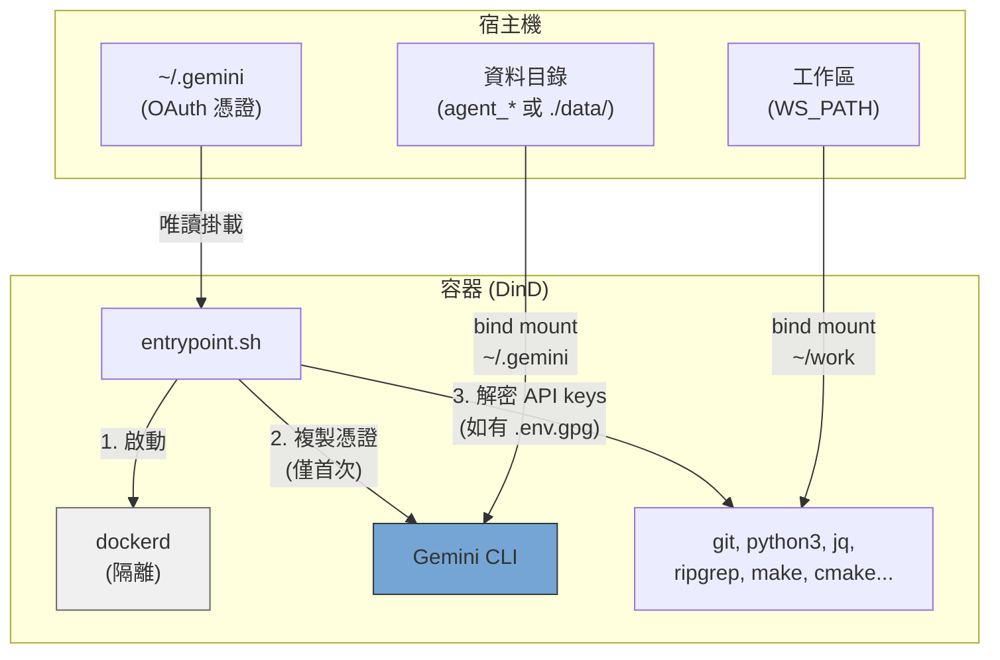
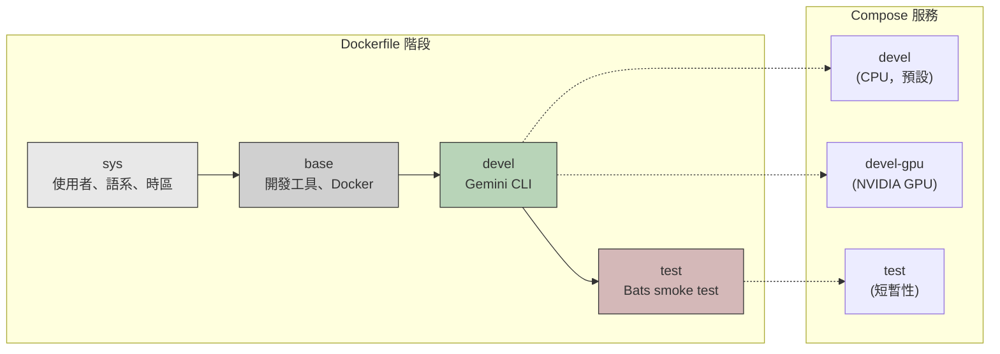
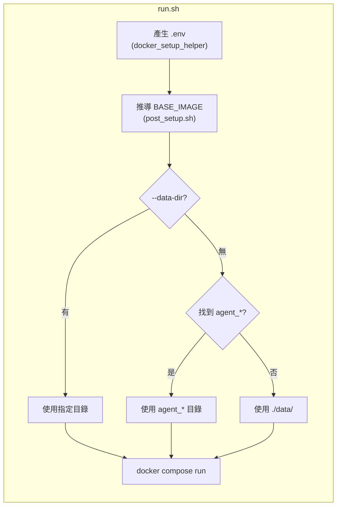

# Gemini CLI Docker 開發環境

內建 Gemini CLI（Google AI 命令列工具）的 Docker-in-Docker (DinD) 開發容器，提供 CPU 與 NVIDIA GPU 兩種版本。以非 root 使用者執行，UID/GID 對應宿主機。

## 目錄

- [TL;DR](#tldr)
- [架構總覽](#架構總覽)
- [前置需求](#前置需求)
- [快速開始](#快速開始)
- [對話紀錄保留](#對話紀錄保留)
- [多開容器](#多開容器)
- [認證方式](#認證方式)
  - [OAuth（互動式登入）](#oauth互動式登入)
  - [API Key（加密儲存）](#api-key加密儲存)
- [組態設定](#組態設定)
- [Smoke Test](#smoke-test)
- [架構說明](#架構說明)
  - [Dockerfile 階段](#dockerfile-階段)
  - [Compose 服務](#compose-服務)
  - [Entrypoint 流程](#entrypoint-流程)
  - [預裝工具](#預裝工具)
  - [容器權限](#容器權限)

## TL;DR

```bash
./build.sh && ./run.sh    # 建置並執行（CPU，預設）
```

- 隔離的 Docker-in-Docker 容器，內建 Gemini CLI
- 非 root 使用者，自動偵測宿主機 UID/GID
- OAuth 憑證首次啟動自動複製，對話紀錄持久化於本地
- 可選 GPG AES-256 加密 API key
- 預設 CPU，GPU 版本透過 `./run.sh devel-gpu`

## 架構總覽







## 前置需求

- Docker 並支援 Compose V2
- GPU 版本需安裝 [nvidia-container-toolkit](https://docs.nvidia.com/datacenter/cloud-native/container-toolkit/install-guide.html)
- 宿主機上先完成 Gemini CLI（`gemini`）的 OAuth 登入

## 快速開始

```bash
# 建置（首次執行會自動產生 .env）
./build.sh              # CPU 版本（預設）
./build.sh devel-gpu    # GPU 版本

# 執行
./run.sh                              # CPU 版本（預設）
./run.sh devel-gpu                    # GPU 版本
./run.sh --data-dir ../agent_foo      # 指定資料目錄

# 進入正在執行的容器
./exec.sh
```

## 對話紀錄保留

對話紀錄與 session 資料透過 bind mount 持久化，容器關閉重開後會保留。

`run.sh` 會自動從專案目錄往上掃描 `agent_*` 目錄。找到就將資料存放在裡面；找不到則退回 `./data/`。

```
# 範例：若存在 ../agent_myproject/
../agent_myproject/
└── .gemini/    # Gemini CLI 對話紀錄、設定、session

# 退回：未找到 agent_* 目錄
./data/
└── .gemini/
```

- 首次啟動：從宿主機唯讀掛載複製 OAuth 憑證到資料目錄
- 後續啟動：資料目錄已有資料，直接使用（不會覆蓋）
- 可自由複製、備份、搬移資料目錄
- 可手動指定：`./run.sh --data-dir /path/to/dir`

## 多開容器

使用 `--project-name`（`-p`）建立完全隔離的實例，各自擁有獨立的 named volume：

```bash
# 第一個實例
docker compose -p gem1 --env-file .env run --rm devel

# 第二個實例（另一個終端）
docker compose -p gem2 --env-file .env run --rm devel

# 第三個實例
docker compose -p gem3 --env-file .env run --rm devel
```

多開時，建立各自的 `agent_*` 目錄：

```bash
mkdir ../agent_proj1 ../agent_proj2

./run.sh --data-dir ../agent_proj1
./run.sh --data-dir ../agent_proj2
```

憑證、對話紀錄、session 資料各自獨立，互不干擾。清除時直接刪除目錄：

```bash
rm -rf ../agent_proj1
```

## 認證方式

支援兩種認證方式，可同時使用。

### OAuth（互動式登入）

適用於 CLI 互動操作。先在宿主機登入：

```bash
gemini   # 登入 Gemini CLI
```

憑證（`~/.gemini`）以唯讀方式掛載進容器，首次啟動時複製到資料目錄。後續啟動直接使用既有資料。

### API Key（加密儲存）

適用於程式化 API 呼叫。金鑰以 GPG（AES-256）加密儲存，不會以明碼存放。

```bash
# 1. 建立明碼 .env
cat <<EOF > .env.keys
GEMINI_API_KEY=xxxxx
EOF

# 2. 加密（會要求設定密碼）
encrypt_env.sh    # 容器內可用，或在宿主機執行 ./encrypt_env.sh

# 3. 刪除明碼
rm .env.keys
```

容器啟動時偵測到工作區中的 `.env.gpg` 會要求輸入密碼，解密後的金鑰僅存在於記憶體中的環境變數。

> **注意：** `.env` 和 `.env.gpg` 已加入 `.gitignore`。

## 組態設定

自動產生的 `.env` 檔控制所有建置與執行參數。詳見 [.env.example](.env.example)。

| 變數 | 說明 |
|------|------|
| `USER_NAME` / `USER_UID` / `USER_GID` | 容器使用者，對應宿主機（自動偵測） |
| `GPU_ENABLED` | 自動偵測，驅動 `BASE_IMAGE` 和 `GPU_VARIANT` |
| `BASE_IMAGE` | `node:20-slim`（CPU）或 `nvidia/cuda:12.3.2-cudnn9-devel-ubuntu22.04`（GPU） |
| `WS_PATH` | 宿主機路徑，掛載到容器內 `~/work` |
| `IMAGE_NAME` | Docker 映像名稱（預設：`gemini_cli`） |

## Smoke Test

建置 test target 以驗證環境：

```bash
./build.sh test
```

測試內容：Gemini CLI 可用性、開發工具、系統設定（非 root 使用者、時區、語系）、確認 Claude/Codex 未安裝，以及確認不必要的工具未安裝（tmux、vim、fzf、terminator）。

## 架構說明

```
.
├── Dockerfile             # 多階段建置（sys → base → devel → test）
├── compose.yaml           # 服務：devel（CPU）、devel-gpu、test
├── build.sh               # 建置腳本，自動產生 .env
├── run.sh                 # 執行腳本，自動產生 .env
├── exec.sh                # 進入正在執行的容器
├── entrypoint.sh          # DinD 啟動、OAuth 複製、API key 解密
├── encrypt_env.sh         # API key 加密輔助腳本
├── post_setup.sh          # 從 GPU_ENABLED 推導 BASE_IMAGE
├── .env.example           # .env 範本
├── smoke_test/            # Bats smoke test
│   ├── gemini_env.bats
│   └── test_helper.bash
├── docker_setup_helper/   # 自動 .env 產生器（git subtree）
├── README.md
└── README_zh-TW.md
```

### Dockerfile 階段

| 階段 | 用途 |
|------|------|
| `sys` | 使用者/群組建立、語系、時區、Node.js（僅 GPU） |
| `base` | 開發工具、Python、建置工具、Docker、jq、ripgrep |
| `devel` | Gemini CLI、entrypoint、切換至非 root 使用者 |
| `test` | Bats smoke test（短暫性，驗證後丟棄） |

### Compose 服務

| 服務 | 說明 |
|------|------|
| `devel` | CPU 版本（預設） |
| `devel-gpu` | GPU 版本，含 NVIDIA device reservation |
| `test` | Smoke test（profile 控制） |

### Entrypoint 流程

1. 透過 sudo 啟動 `dockerd`（DinD），等待就緒（最多 30 秒）
2. 從唯讀掛載複製 OAuth 憑證到資料目錄（僅首次啟動）
3. 解密 `.env.gpg` 並匯出 API keys 為環境變數（如有檔案）
4. 執行 CMD（`bash`）

### 預裝工具

| 工具 | 用途 |
|------|------|
| Gemini CLI | Google AI CLI |
| Docker (DinD) | 容器內獨立的 Docker daemon |
| Node.js 20 | CLI 工具執行環境 |
| Python 3 | 腳本與開發 |
| git, curl, wget | 版本控制與下載 |
| jq, ripgrep | JSON 處理與程式碼搜尋 |
| make, g++, cmake | 編譯建置工具鏈 |
| tree | 目錄結構視覺化 |

GPU 版本額外包含：CUDA 12.3.2、cuDNN 9、OpenCL、Vulkan。

### 容器權限

兩個 service 皆需要 `SYS_ADMIN`、`NET_ADMIN`、`MKNOD` capabilities 與 `seccomp:unconfined`，以支援 DinD 運作。容器內的 Docker daemon 與宿主機完全隔離。
