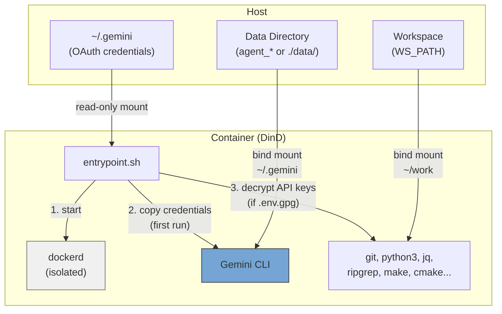
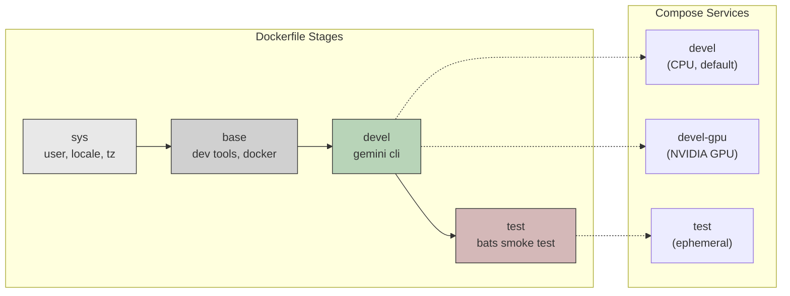
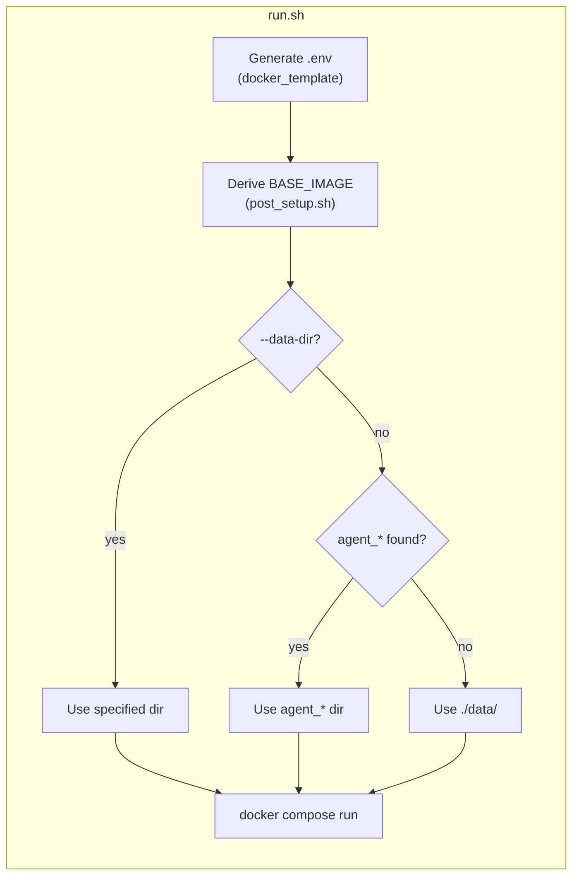

**[English](../README.md)** | **[繁體中文](README.zh-TW.md)** | **[简体中文](README.zh-CN.md)** | **日本語**

# Gemini CLI Docker 環境

Docker-in-Docker (DinD) 開発コンテナ。Google AI コマンドラインツール Gemini CLI を搭載しています。CPU と NVIDIA GPU の2つのバリアントを提供し、非 root ユーザーで実行され、ホストの UID/GID を自動的にマッチングします。

## 目次

- [TL;DR](#tldr)
- [概要](#概要)
- [前提条件](#前提条件)
- [クイックスタート](#クイックスタート)
- [会話の永続化](#会話の永続化)
- [複数インスタンスの実行](#複数インスタンスの実行)
- [認証](#認証)
  - [OAuth（対話式ログイン）](#oauth対話式ログイン)
  - [API キー（暗号化）](#api-キー暗号化)
- [Subtree としての利用](#subtree-としての利用)
- [設定](#設定)
- [スモークテスト](#スモークテスト)
- [アーキテクチャ](#アーキテクチャ)
  - [Dockerfile ステージ](#dockerfile-ステージ)
  - [Compose サービス](#compose-サービス)
  - [エントリポイントフロー](#エントリポイントフロー)
  - [プリインストール済みツール](#プリインストール済みツール)
  - [コンテナ能力](#コンテナ能力)

## TL;DR

```bash
./build.sh && ./run.sh    # Build and run (CPU, default)
```

- Gemini CLI がプリインストールされた独立 Docker-in-Docker コンテナ
- 非 root ユーザー、ホストから UID/GID を自動検出
- 初回実行時に OAuth 認証情報を自動コピー、会話履歴はローカルに永続化
- 暗号化 API キー（GPG AES-256）をオプションで使用可能
- デフォルトは CPU、GPU バリアントは `./run.sh devel-gpu` で起動

## 概要







## 前提条件

- Docker（Compose V2 対応）
- GPU バリアントには [nvidia-container-toolkit](https://docs.nvidia.com/datacenter/cloud-native/container-toolkit/install-guide.html) が必要
- ホスト側で Gemini CLI の OAuth ログインを完了していること（`gemini`）

## クイックスタート

```bash
# Build (auto-generates .env on every run)
./build.sh              # CPU variant (default)
./build.sh devel-gpu    # GPU variant
./build.sh --no-env test  # ビルドのみ、.env 更新なし

# Run
./run.sh                          # CPU variant (default)
./run.sh devel-gpu                # GPU variant
./run.sh --data-dir ../agent_foo  # Specify data directory
./run.sh --no-env -d              # バックグラウンド起動、.env 更新をスキップ

# Exec into running container
./exec.sh
```

## 会話の永続化

会話履歴と Session データは bind mount により永続化され、コンテナ再起動後も保持されます。

`run.sh` はプロジェクトディレクトリから上方向に `agent_*` ディレクトリを自動スキャンします。見つかった場合はそのディレクトリにデータを保存し、見つからない場合は `./data/` にフォールバックします。

```
# Example: if ../agent_myproject/ exists
../agent_myproject/
└── .gemini/    # Gemini CLI conversations, settings, session

# Fallback: no agent_* directory found
./data/
└── .gemini/
```

- 初回起動：OAuth 認証情報をホストからデータディレクトリにコピー
- 以降の起動：データディレクトリに既存データがあれば、そのまま使用（上書きしない）
- データディレクトリは自由にコピー、バックアップ、移動が可能
- 手動指定：`./run.sh --data-dir /path/to/dir`

## 複数インスタンスの実行

`--project-name`（`-p`）を使用して完全に隔離されたインスタンスを作成し、各インスタンスは独立した名前付き Volume を持ちます：

```bash
# Instance 1
docker compose -p gem1 --env-file .env run --rm devel

# Instance 2 (in another terminal)
docker compose -p gem2 --env-file .env run --rm devel

# Instance 3
docker compose -p gem3 --env-file .env run --rm devel
```

複数インスタンスを実行する場合は、それぞれ対応する `agent_*` ディレクトリを作成してください：

```bash
mkdir ../agent_proj1 ../agent_proj2

./run.sh --data-dir ../agent_proj1
./run.sh --data-dir ../agent_proj2
```

認証情報、会話履歴、Session データは完全に隔離されます。クリーンアップ時は対応するディレクトリを削除するだけです：

```bash
rm -rf ../agent_proj1
```

## 認証

2つの方式をサポートしており、併用可能です。

### OAuth（対話式ログイン）

対話式 CLI 使用に適しています。まずホスト側でログインしてください：

```bash
gemini   # Log in to Gemini CLI
```

認証情報（`~/.gemini`）は読み取り専用でコンテナにマウントされ、初回起動時にデータディレクトリにコピーされます。以降の起動では既存データをそのまま使用します。

### API キー（暗号化）

プログラムによる API アクセスに適しています。キーは GPG（AES-256）で暗号化して保存され、平文では保存されません。

```bash
# 1. Create plaintext .env
cat <<EOF > .env.keys
GEMINI_API_KEY=xxxxx
EOF

# 2. Encrypt (you will be prompted to set a passphrase)
encrypt_env.sh    # available inside container, or ./encrypt_env.sh on host

# 3. Remove plaintext
rm .env.keys
```

コンテナ起動時にワークスペースで `.env.gpg` が検出されると、パスフレーズの入力を求められます。復号されたキーは環境変数としてメモリ上にのみ保持されます。

> **注意：** `.env` と `.env.gpg` は `.gitignore` に登録されています。

## Subtree としての利用

このリポジトリは `git subtree` を使って他のプロジェクトに組み込むことができ、プロジェクト自体に Docker 開発環境を持たせることができます。

### プロジェクトへの追加

```bash
git subtree add --prefix=docker/gemini_cli \
    https://github.com/ycpss91255-docker/gemini_cli.git main --squash
```

追加後のディレクトリ構造の例：

```text
my_project/
├── src/                         # プロジェクトのソースコード
├── docker/gemini_cli/           # Subtree
│   ├── build.sh
│   ├── run.sh
│   ├── compose.yaml
│   ├── Dockerfile
│   └── docker_template/
└── ...
```

### ビルドと実行

```bash
cd docker/gemini_cli
./build.sh && ./run.sh
```

`build.sh` は内部で `--base-path` を使用しているため、どこから実行してもパス検出が正しく動作します。

### ワークスペース検出の動作

<details>
<summary>クリックして subtree として使用時の検出動作を表示</summary>

subtree が `my_project/docker/gemini_cli/` にある場合：

- **IMAGE_NAME**：ディレクトリ名が `gemini_cli`（`docker_*` ではない）のため、検出は `.env.example` にフォールバックし、`IMAGE_NAME=gemini_cli` が設定されています — 正常に動作します。
- **WS_PATH**：戦略 1（同階層スキャン）と戦略 2（上方向の走査）はマッチしない可能性があるため、戦略 3（フォールバック）が親ディレクトリ（`my_project/docker/`）に解決します。

**推奨**：初回ビルド後、`.env` の `WS_PATH` を実際のワークスペースに編集してください。この値は以降のビルドで保持されます。

</details>

### 上流との同期

```bash
git subtree pull --prefix=docker/gemini_cli \
    https://github.com/ycpss91255-docker/gemini_cli.git main --squash
```

> **注意事項**：
> - ローカルの変更は git によって通常通り追跡されます。
> - 上流がローカルで変更したファイルと同じファイルを変更した場合、`subtree pull` でマージコンフリクトが発生する可能性があります。
> - subtree 内の `docker_template/` は**変更しないでください** — env リポジトリ自体の subtree によって管理されています。

## 設定

`build.sh` / `run.sh` の実行時に `.env` が自動生成されます（`--no-env` でスキップ可能）。詳細は [.env.example](.env.example) を参照してください。

| 変数 | 説明 |
|------|------|
| `USER_NAME` / `USER_UID` / `USER_GID` | ホストに対応するコンテナユーザー（自動検出） |
| `GPU_ENABLED` | 自動検出、`BASE_IMAGE` と `GPU_VARIANT` を決定 |
| `BASE_IMAGE` | `node:20-slim`（CPU）または `nvidia/cuda:13.1.1-cudnn-devel-ubuntu24.04`（GPU） |
| `WS_PATH` | コンテナ内の `~/work` にマウントされるホストパス |
| `IMAGE_NAME` | Docker イメージ名（デフォルト：`gemini_cli`） |

## スモークテスト

test ターゲットをビルドして環境を検証：

```bash
./build.sh test
```

`smoke_test/agent_env.bats` に配置、全 **29** 項目。

<details>
<summary>クリックしてテスト詳細を表示</summary>

#### AI ツール (3)

| テスト項目 | 説明 |
|------------|------|
| `claude` | 利用可能 |
| `gemini` | 利用可能 |
| `codex` | 利用可能 |

#### 開発ツール (14)

| テスト項目 | 説明 |
|------------|------|
| `node` | 利用可能 |
| `npm` | 利用可能 |
| `git` | 利用可能 |
| `python3` | 利用可能 |
| `make` | 利用可能 |
| `cmake` | 利用可能 |
| `g++` | 利用可能 |
| `curl` | 利用可能 |
| `wget` | 利用可能 |
| `jq` | 利用可能 |
| `rg` (ripgrep) | 利用可能 |
| `tree` | 利用可能 |
| `docker` | 利用可能 |
| `gpg` | 利用可能 |

#### システム (7)

| テスト項目 | 説明 |
|------------|------|
| ユーザー | 非 root |
| `sudo` | パスワードなしで実行可能 |
| タイムゾーン | `Asia/Taipei` |
| `LANG` | `en_US.UTF-8` |
| work ディレクトリ | 存在する |
| work ディレクトリ | 書き込み可能 |
| `entrypoint.sh` | 存在する |

#### 除外ツール (4)

| テスト項目 | 説明 |
|------------|------|
| `tmux` | 未インストール（最小化イメージ） |
| `vim` | 未インストール |
| `fzf` | 未インストール |
| `terminator` | 未インストール |

#### セキュリティ (1)

| テスト項目 | 説明 |
|------------|------|
| `encrypt_env.sh` | PATH に存在 |

</details>

## アーキテクチャ

```
.
├── Dockerfile             # Multi-stage build (sys -> base -> devel -> test)
├── compose.yaml           # Services: devel (CPU), devel-gpu, test
├── build.sh               # Build with auto .env generation
├── run.sh                 # Run with auto .env generation
├── exec.sh                # Exec into running container
├── entrypoint.sh          # DinD startup, OAuth copy, API key decryption
├── encrypt_env.sh         # Helper to encrypt API keys
├── post_setup.sh          # Derives BASE_IMAGE from GPU_ENABLED
├── .env.example           # Template for .env
├── smoke_test/            # Bats smoke tests
│   ├── gemini_env.bats
│   └── test_helper.bash
├── docker_template/   # Auto .env generator (git subtree)
├── README.md
└── README.zh-TW.md
```

### Dockerfile ステージ

| ステージ | 用途 |
|----------|------|
| `sys` | ユーザー/グループ作成、ロケール、タイムゾーン、Node.js（GPU のみ） |
| `base` | 開発ツール、Python、ビルドツール、Docker、jq、ripgrep |
| `devel` | Gemini CLI、エントリポイント、非 root ユーザー |
| `test` | Bats スモークテスト（一時的、検証後に破棄） |

### Compose サービス

| サービス | 説明 |
|----------|------|
| `devel` | CPU バリアント（デフォルト） |
| `devel-gpu` | GPU バリアント、NVIDIA デバイス予約付き |
| `test` | スモークテスト（profile で制御） |

### エントリポイントフロー

1. sudo で `dockerd`（DinD）を起動し、準備完了まで待機（最大 30 秒）
2. OAuth 認証情報を読み取り専用マウントから `data/` ディレクトリにコピー（初回実行時のみ）
3. `.env.gpg` を復号し、API キーを環境変数としてエクスポート（存在する場合）
4. CMD（`bash`）を実行

### プリインストール済みツール

| ツール | 用途 |
|--------|------|
| Gemini CLI | Google AI CLI |
| Docker (DinD) | コンテナ内の独立した Docker daemon |
| Node.js 20 | CLI ツールのランタイム |
| Python 3 | スクリプト作成と開発 |
| git, curl, wget | バージョン管理とダウンロード |
| jq, ripgrep | JSON 処理とコード検索 |
| make, g++, cmake | ビルドツールチェーン |
| tree | ディレクトリ構造の可視化 |

GPU バリアントには追加で CUDA 13.1.1、cuDNN、OpenCL、Vulkan が含まれます。

### コンテナ能力

両サービスとも DinD の正常動作のために `SYS_ADMIN`、`NET_ADMIN`、`MKNOD` 能力と `seccomp:unconfined` が必要です。内部 Docker daemon はホストから完全に隔離されています。
