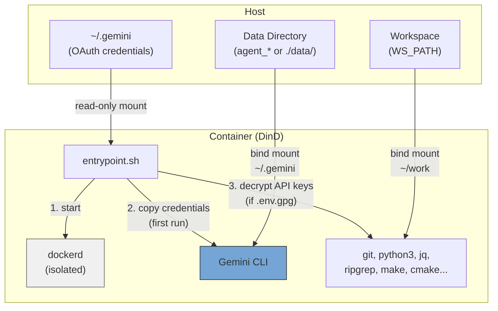
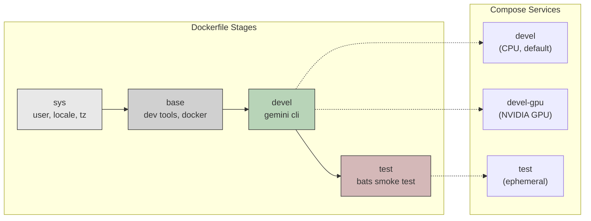
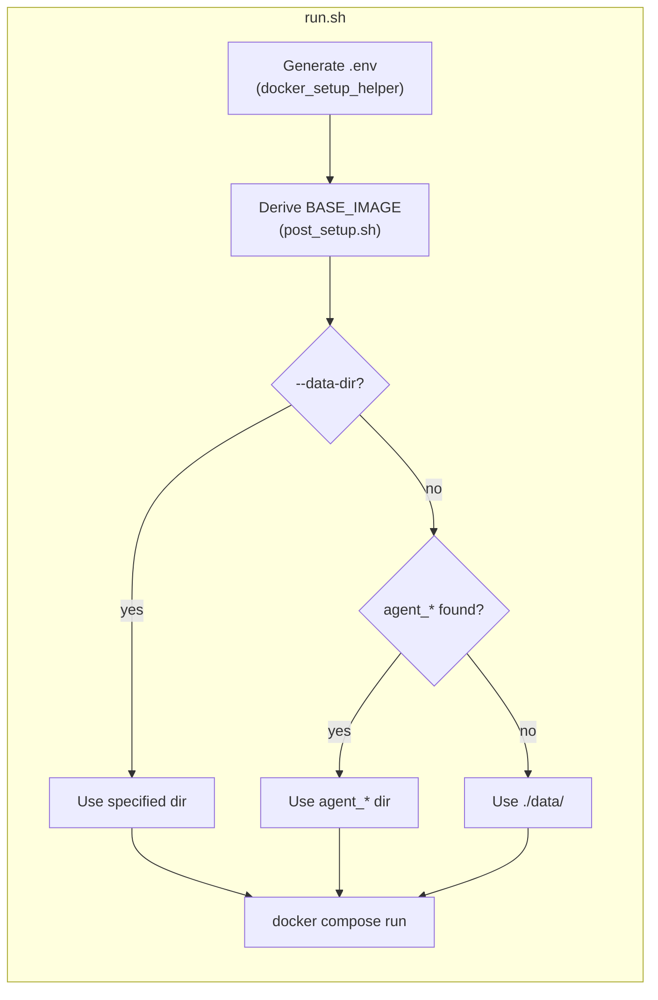

**[English](../README.md)** | **[繁體中文](README.zh-TW.md)** | **简体中文** | **[日本語](README.ja.md)**

# Gemini CLI Docker 环境

Docker-in-Docker (DinD) 开发容器，搭载 Google AI 命令行工具 Gemini CLI。提供 CPU 与 NVIDIA GPU 两种版本，以非 root 用户身份执行，并自动匹配主机的 UID/GID。

## 目录

- [TL;DR](#tldr)
- [概览](#概览)
- [前置需求](#前置需求)
- [快速开始](#快速开始)
- [对话持久化](#对话持久化)
- [执行多个实例](#执行多个实例)
- [验证](#验证)
  - [OAuth（交互式登录）](#oauth交互式登录)
  - [API 密钥（加密）](#api-密钥加密)
- [设置](#设置)
- [冒烟测试](#冒烟测试)
- [架构](#架构)
  - [Dockerfile 阶段](#dockerfile-阶段)
  - [Compose 服务](#compose-服务)
  - [入口点流程](#入口点流程)
  - [预装工具](#预装工具)
  - [容器能力](#容器能力)

## TL;DR

```bash
./build.sh && ./run.sh    # Build and run (CPU, default)
```

- 独立的 Docker-in-Docker 容器，预装 Gemini CLI
- 非 root 用户，自动从主机检测 UID/GID
- 首次执行时自动复制 OAuth 凭证，对话记录持久化于本机
- 可选用加密 API 密钥（GPG AES-256）
- 默认使用 CPU，GPU 版本通过 `./run.sh devel-gpu` 启动

## 概览







## 前置需求

- 安装 Docker 并支持 Compose V2
- GPU 版本需安装 [nvidia-container-toolkit](https://docs.nvidia.com/datacenter/cloud-native/container-toolkit/install-guide.html)
- 主机端需先完成 Gemini CLI 的 OAuth 登录（`gemini`）

## 快速开始

```bash
# Build (auto-generates .env on every run)
./build.sh              # CPU variant (default)
./build.sh devel-gpu    # GPU variant
./build.sh --no-env test  # 构建但不更新 .env

# Run
./run.sh                          # CPU variant (default)
./run.sh devel-gpu                # GPU variant
./run.sh --data-dir ../agent_foo  # Specify data directory
./run.sh --no-env -d              # 后台启动，跳过 .env 更新

# Exec into running container
./exec.sh
```

## 对话持久化

对话历史与 Session 数据通过 bind mount 持久化，容器重启后仍会保留。

`run.sh` 会从项目目录往上自动扫描是否存在 `agent_*` 目录。若找到则将数据存放于该目录；否则回退使用 `./data/`。

```
# Example: if ../agent_myproject/ exists
../agent_myproject/
└── .gemini/    # Gemini CLI conversations, settings, session

# Fallback: no agent_* directory found
./data/
└── .gemini/
```

- 首次启动：OAuth 凭证会从主机复制到数据目录
- 后续启动：数据目录已有数据，直接使用（不覆盖）
- 可自由复制、备份或移动数据目录
- 手动指定：`./run.sh --data-dir /path/to/dir`

## 执行多个实例

使用 `--project-name`（`-p`）创建完全隔离的实例，每个实例拥有独立的具名 Volume：

```bash
# Instance 1
docker compose -p gem1 --env-file .env run --rm devel

# Instance 2 (in another terminal)
docker compose -p gem2 --env-file .env run --rm devel

# Instance 3
docker compose -p gem3 --env-file .env run --rm devel
```

若需执行多个实例，请分别创建对应的 `agent_*` 目录：

```bash
mkdir ../agent_proj1 ../agent_proj2

./run.sh --data-dir ../agent_proj1
./run.sh --data-dir ../agent_proj2
```

凭证、对话记录与 Session 数据完全隔离。清除时直接删除对应目录即可：

```bash
rm -rf ../agent_proj1
```

## 验证

支持两种方式，可同时使用。

### OAuth（交互式登录）

适用于交互式 CLI 使用。请先在主机端登录：

```bash
gemini   # Log in to Gemini CLI
```

凭证（`~/.gemini`）以只读方式挂载至容器，并于首次启动时复制至数据目录。后续启动直接沿用已有的数据。

### API 密钥（加密）

适用于程序化 API 访问。密钥以 GPG（AES-256）加密存储，从不以明文保存。

```bash
# 1. Create plaintext .env
cat <<EOF > .env.keys
GEMINI_API_KEY=xxxxx
EOF

# 2. Encrypt (you will be prompted to set a passphrase)
encrypt_env.sh    # available inside container, or ./encrypt_env.sh on host

# 3. Remove plaintext
rm .env.keys
```

容器启动时，若在工作区检测到 `.env.gpg`，将提示输入密码。解密后的密钥仅以环境变量的形式保存于内存中。

> **注意：** `.env` 与 `.env.gpg` 已加入 `.gitignore`。

## 设置

每次执行 `build.sh` / `run.sh` 时会自动生成 `.env`（可传入 `--no-env` 跳过）。详细说明请参考 [.env.example](.env.example)。

| 变量 | 说明 |
|------|------|
| `USER_NAME` / `USER_UID` / `USER_GID` | 与主机匹配的容器用户（自动检测） |
| `GPU_ENABLED` | 自动检测，决定 `BASE_IMAGE` 与 `GPU_VARIANT` |
| `BASE_IMAGE` | `node:20-slim`（CPU）或 `nvidia/cuda:13.1.1-cudnn-devel-ubuntu24.04`（GPU） |
| `WS_PATH` | 挂载至容器内 `~/work` 的主机路径 |
| `IMAGE_NAME` | Docker 镜像名称（默认：`gemini_cli`） |

## 冒烟测试

构建 test target 验证环境：

```bash
./build.sh test
```

位于 `smoke_test/agent_env.bats`，共 **29** 项。

<details>
<summary>展开查看测试详情</summary>

#### AI 工具 (3)

| 测试项目 | 说明 |
|----------|------|
| `claude` | 可用 |
| `gemini` | 可用 |
| `codex` | 可用 |

#### 开发工具 (14)

| 测试项目 | 说明 |
|----------|------|
| `node` | 可用 |
| `npm` | 可用 |
| `git` | 可用 |
| `python3` | 可用 |
| `make` | 可用 |
| `cmake` | 可用 |
| `g++` | 可用 |
| `curl` | 可用 |
| `wget` | 可用 |
| `jq` | 可用 |
| `rg` (ripgrep) | 可用 |
| `tree` | 可用 |
| `docker` | 可用 |
| `gpg` | 可用 |

#### 系统 (7)

| 测试项目 | 说明 |
|----------|------|
| 用户 | 非 root |
| `sudo` | 免密码执行 |
| 时区 | `Asia/Taipei` |
| `LANG` | `en_US.UTF-8` |
| work 目录 | 存在 |
| work 目录 | 可写入 |
| `entrypoint.sh` | 存在 |

#### 排除工具 (4)

| 测试项目 | 说明 |
|----------|------|
| `tmux` | 未安装（最小化镜像） |
| `vim` | 未安装 |
| `fzf` | 未安装 |
| `terminator` | 未安装 |

#### 安全性 (1)

| 测试项目 | 说明 |
|----------|------|
| `encrypt_env.sh` | 在 PATH 中 |

</details>

## 架构

```
.
├── Dockerfile             # Multi-stage build (sys -> base -> devel -> test)
├── compose.yaml           # Services: devel (CPU), devel-gpu, test
├── build.sh               # Build with auto .env generation
├── run.sh                 # Run with auto .env generation
├── exec.sh                # Exec into running container
├── entrypoint.sh          # DinD startup, OAuth copy, API key decryption
├── encrypt_env.sh         # Helper to encrypt API keys
├── post_setup.sh          # Derives BASE_IMAGE from GPU_ENABLED
├── .env.example           # Template for .env
├── smoke_test/            # Bats smoke tests
│   ├── gemini_env.bats
│   └── test_helper.bash
├── docker_setup_helper/   # Auto .env generator (git subtree)
├── README.md
└── README.zh-TW.md
```

### Dockerfile 阶段

| 阶段 | 用途 |
|------|------|
| `sys` | 用户/群组创建、语言环境、时区、Node.js（仅 GPU） |
| `base` | 开发工具、Python、构建工具、Docker、jq、ripgrep |
| `devel` | Gemini CLI、入口点、非 root 用户 |
| `test` | Bats 冒烟测试（临时性，验证后即舍弃） |

### Compose 服务

| 服务 | 说明 |
|------|------|
| `devel` | CPU 版本（默认） |
| `devel-gpu` | GPU 版本，保留 NVIDIA 设备 |
| `test` | 冒烟测试（以 profile 控管） |

### 入口点流程

1. 通过 sudo 启动 `dockerd`（DinD），等待就绪（最多 30 秒）
2. 将 OAuth 凭证从只读挂载点复制至 `data/` 目录（仅首次执行）
3. 解密 `.env.gpg` 并将 API 密钥导出为环境变量（若存在）
4. 执行 CMD（`bash`）

### 预装工具

| 工具 | 用途 |
|------|------|
| Gemini CLI | Google AI CLI |
| Docker (DinD) | 容器内的独立 Docker daemon |
| Node.js 20 | CLI 工具执行环境 |
| Python 3 | 脚本编写与开发 |
| git, curl, wget | 版本控制与下载 |
| jq, ripgrep | JSON 处理与代码搜索 |
| make, g++, cmake | 构建工具链 |
| tree | 目录结构可视化 |

GPU 版本另外包含：CUDA 13.1.1、cuDNN、OpenCL、Vulkan。

### 容器能力

两个服务均需要 `SYS_ADMIN`、`NET_ADMIN`、`MKNOD` 能力，并设置 `seccomp:unconfined`，以确保 DinD 正常运作。内部 Docker daemon 与主机完全隔离。
