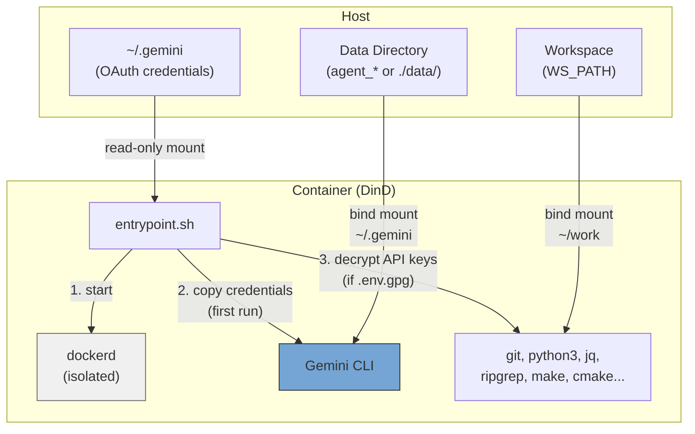
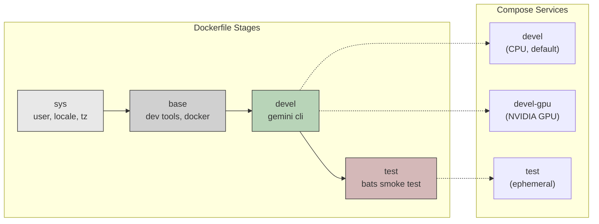
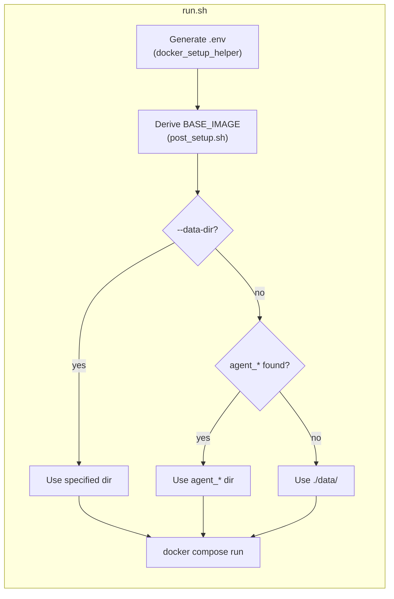

**[English](../README.md)** | **繁體中文** | **[简体中文](README.zh-CN.md)** | **[日本語](README.ja.md)**

# Gemini CLI Docker Environment

Docker-in-Docker (DinD) 開發容器，搭載 Google AI 命令列工具 Gemini CLI。提供 CPU 與 NVIDIA GPU 兩種版本，以非 root 使用者身份執行，並自動匹配主機的 UID/GID。

## 目錄

- [TL;DR](#tldr)
- [概覽](#概覽)
- [前置需求](#前置需求)
- [快速開始](#快速開始)
- [對話持久化](#對話持久化)
- [執行多個實例](#執行多個實例)
- [驗證](#驗證)
  - [OAuth（互動式登入）](#oauth互動式登入)
  - [API 金鑰（加密）](#api-金鑰加密)
- [設定](#設定)
- [冒煙測試](#冒煙測試)
- [架構](#架構)
  - [Dockerfile 階段](#dockerfile-階段)
  - [Compose 服務](#compose-服務)
  - [Entrypoint 流程](#entrypoint-流程)
  - [預裝工具](#預裝工具)
  - [容器能力](#容器能力)

## TL;DR

```bash
./build.sh && ./run.sh    # Build and run (CPU, default)
```

- 獨立的 Docker-in-Docker 容器，預裝 Gemini CLI
- 非 root 使用者，自動從主機偵測 UID/GID
- 首次執行時自動複製 OAuth 憑證，對話紀錄持久化於本機
- 可選用加密 API 金鑰（GPG AES-256）
- 預設使用 CPU，GPU 版本透過 `./run.sh devel-gpu` 啟動

## 概覽







## 前置需求

- 安裝 Docker 並支援 Compose V2
- GPU 版本需安裝 [nvidia-container-toolkit](https://docs.nvidia.com/datacenter/cloud-native/container-toolkit/install-guide.html)
- 主機端需先完成 Gemini CLI 的 OAuth 登入（`gemini`）

## 快速開始

```bash
# Build (auto-generates .env on every run)
./build.sh              # CPU variant (default)
./build.sh devel-gpu    # GPU variant
./build.sh --no-env test  # 建置但不更新 .env

# Run
./run.sh                          # CPU variant (default)
./run.sh devel-gpu                # GPU variant
./run.sh --data-dir ../agent_foo  # Specify data directory
./run.sh --no-env -d              # 背景啟動，跳過 .env 更新

# Exec into running container
./exec.sh
```

## 對話持久化

對話歷史與 Session 資料透過 bind mount 持久化，容器重啟後仍會保留。

`run.sh` 會從專案目錄往上自動掃描是否存在 `agent_*` 目錄。若找到則將資料存放於該目錄；否則退回使用 `./data/`。

```
# Example: if ../agent_myproject/ exists
../agent_myproject/
└── .gemini/    # Gemini CLI conversations, settings, session

# Fallback: no agent_* directory found
./data/
└── .gemini/
```

- 首次啟動：OAuth 憑證會從主機複製到資料目錄
- 後續啟動：資料目錄已有資料，直接使用（不覆蓋）
- 可自由複製、備份或移動資料目錄
- 手動指定：`./run.sh --data-dir /path/to/dir`

## 執行多個實例

使用 `--project-name`（`-p`）建立完全隔離的實例，每個實例擁有獨立的具名 Volume：

```bash
# Instance 1
docker compose -p gem1 --env-file .env run --rm devel

# Instance 2 (in another terminal)
docker compose -p gem2 --env-file .env run --rm devel

# Instance 3
docker compose -p gem3 --env-file .env run --rm devel
```

若需執行多個實例，請分別建立對應的 `agent_*` 目錄：

```bash
mkdir ../agent_proj1 ../agent_proj2

./run.sh --data-dir ../agent_proj1
./run.sh --data-dir ../agent_proj2
```

憑證、對話紀錄與 Session 資料完全隔離。清除時直接刪除對應目錄即可：

```bash
rm -rf ../agent_proj1
```

## 驗證

支援兩種方式，可同時使用。

### OAuth（互動式登入）

適用於互動式 CLI 使用。請先在主機端登入：

```bash
gemini   # Log in to Gemini CLI
```

憑證（`~/.gemini`）以唯讀方式掛載至容器，並於首次啟動時複製至資料目錄。後續啟動直接沿用已有的資料。

### API 金鑰（加密）

適用於程式化 API 存取。金鑰以 GPG（AES-256）加密儲存，從不以明文保存。

```bash
# 1. Create plaintext .env
cat <<EOF > .env.keys
GEMINI_API_KEY=xxxxx
EOF

# 2. Encrypt (you will be prompted to set a passphrase)
encrypt_env.sh    # available inside container, or ./encrypt_env.sh on host

# 3. Remove plaintext
rm .env.keys
```

容器啟動時，若在工作區偵測到 `.env.gpg`，將提示輸入密碼。解密後的金鑰僅以環境變數的形式保存於記憶體中。

> **注意：** `.env` 與 `.env.gpg` 已加入 `.gitignore`。

## 設定

每次執行 `build.sh` / `run.sh` 時會自動產生 `.env`（可傳入 `--no-env` 跳過）。詳細說明請參考 [.env.example](.env.example)。

| 變數 | 說明 |
|------|------|
| `USER_NAME` / `USER_UID` / `USER_GID` | 與主機匹配的容器使用者（自動偵測） |
| `GPU_ENABLED` | 自動偵測，決定 `BASE_IMAGE` 與 `GPU_VARIANT` |
| `BASE_IMAGE` | `node:20-slim`（CPU）或 `nvidia/cuda:13.1.1-cudnn-devel-ubuntu24.04`（GPU） |
| `WS_PATH` | 掛載至容器內 `~/work` 的主機路徑 |
| `IMAGE_NAME` | Docker 映像名稱（預設：`gemini_cli`） |

## 冒煙測試

建置 test target 驗證環境：

```bash
./build.sh test
```

位於 `smoke_test/agent_env.bats`，共 **29** 項。

<details>
<summary>展開查看測試細項</summary>

#### AI 工具 (3)

| 測試項目 | 說明 |
|----------|------|
| `claude` | 可用 |
| `gemini` | 可用 |
| `codex` | 可用 |

#### 開發工具 (14)

| 測試項目 | 說明 |
|----------|------|
| `node` | 可用 |
| `npm` | 可用 |
| `git` | 可用 |
| `python3` | 可用 |
| `make` | 可用 |
| `cmake` | 可用 |
| `g++` | 可用 |
| `curl` | 可用 |
| `wget` | 可用 |
| `jq` | 可用 |
| `rg` (ripgrep) | 可用 |
| `tree` | 可用 |
| `docker` | 可用 |
| `gpg` | 可用 |

#### 系統 (7)

| 測試項目 | 說明 |
|----------|------|
| 用戶 | 非 root |
| `sudo` | 免密碼執行 |
| 時區 | `Asia/Taipei` |
| `LANG` | `en_US.UTF-8` |
| work 目錄 | 存在 |
| work 目錄 | 可寫入 |
| `entrypoint.sh` | 存在 |

#### 排除工具 (4)

| 測試項目 | 說明 |
|----------|------|
| `tmux` | 未安裝（最小化映像） |
| `vim` | 未安裝 |
| `fzf` | 未安裝 |
| `terminator` | 未安裝 |

#### 安全性 (1)

| 測試項目 | 說明 |
|----------|------|
| `encrypt_env.sh` | 在 PATH 中 |

</details>

## 架構

```
.
├── Dockerfile             # Multi-stage build (sys -> base -> devel -> test)
├── compose.yaml           # Services: devel (CPU), devel-gpu, test
├── build.sh               # Build with auto .env generation
├── run.sh                 # Run with auto .env generation
├── exec.sh                # Exec into running container
├── entrypoint.sh          # DinD startup, OAuth copy, API key decryption
├── encrypt_env.sh         # Helper to encrypt API keys
├── post_setup.sh          # Derives BASE_IMAGE from GPU_ENABLED
├── .env.example           # Template for .env
├── smoke_test/            # Bats smoke tests
│   ├── gemini_env.bats
│   └── test_helper.bash
├── docker_setup_helper/   # Auto .env generator (git subtree)
├── README.md
└── README.zh-TW.md
```

### Dockerfile 階段

| 階段 | 用途 |
|------|------|
| `sys` | 使用者/群組建立、語系、時區、Node.js（僅 GPU） |
| `base` | 開發工具、Python、建置工具、Docker、jq、ripgrep |
| `devel` | Gemini CLI、entrypoint、非 root 使用者 |
| `test` | Bats 冒煙測試（暫時性，驗證後即捨棄） |

### Compose 服務

| 服務 | 說明 |
|------|------|
| `devel` | CPU 版本（預設） |
| `devel-gpu` | GPU 版本，保留 NVIDIA 裝置 |
| `test` | 冒煙測試（以 profile 控管） |

### Entrypoint 流程

1. 透過 sudo 啟動 `dockerd`（DinD），等待就緒（最多 30 秒）
2. 將 OAuth 憑證從唯讀掛載點複製至 `data/` 目錄（僅首次執行）
3. 解密 `.env.gpg` 並將 API 金鑰匯出為環境變數（若存在）
4. 執行 CMD（`bash`）

### 預裝工具

| 工具 | 用途 |
|------|------|
| Gemini CLI | Google AI CLI |
| Docker (DinD) | 容器內的獨立 Docker daemon |
| Node.js 20 | CLI 工具執行環境 |
| Python 3 | 腳本撰寫與開發 |
| git, curl, wget | 版本控制與下載 |
| jq, ripgrep | JSON 處理與程式碼搜尋 |
| make, g++, cmake | 建置工具鏈 |
| tree | 目錄結構視覺化 |

GPU 版本另外包含：CUDA 13.1.1、cuDNN、OpenCL、Vulkan。

### 容器能力

兩個服務均需要 `SYS_ADMIN`、`NET_ADMIN`、`MKNOD` 能力，並設定 `seccomp:unconfined`，以確保 DinD 正常運作。內部 Docker daemon 與主機完全隔離。
